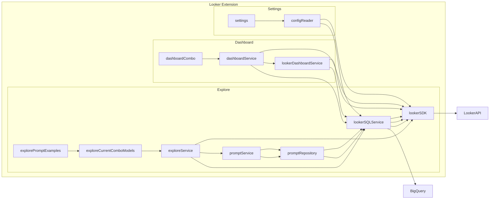

# testing mermaid

```mermaid
graph LR
    subgraph Looker Extension
        subgraph Explore
            explorePromptExamples --> exploreCurrentComboModels
            exploreCurrentComboModels --> exploreService
            exploreService --> lookerSDK
            exploreService --> promptService
            exploreService --> lookerSQLService
            lookerSQLService --> lookerSDK
            promptService --> promptRepository
            promptRepository --> lookerSQLService
        end
        subgraph Dashboard
            dashboardCombo --> dashboardService
            dashboardService --> lookerSDK
            dashboardService --> lookerDashboardService
            dashboardService --> lookerSQLService
            lookerSQLService --> lookerSDK
            lookerDashboardService --> lookerSDK
            lookerDashboardService --> lookerSQLService
        end
        subgraph Settings
            settings --> configReader
            configReader --> lookerSDK
            configReader --> lookerSQLService
            lookerSQLService --> lookerSDK
            promptService --> promptRepository
            promptRepository --> lookerSQLService
        end
    end
    lookerSDK --> LookerAPI
    lookerSQLService --> BigQuery
```
